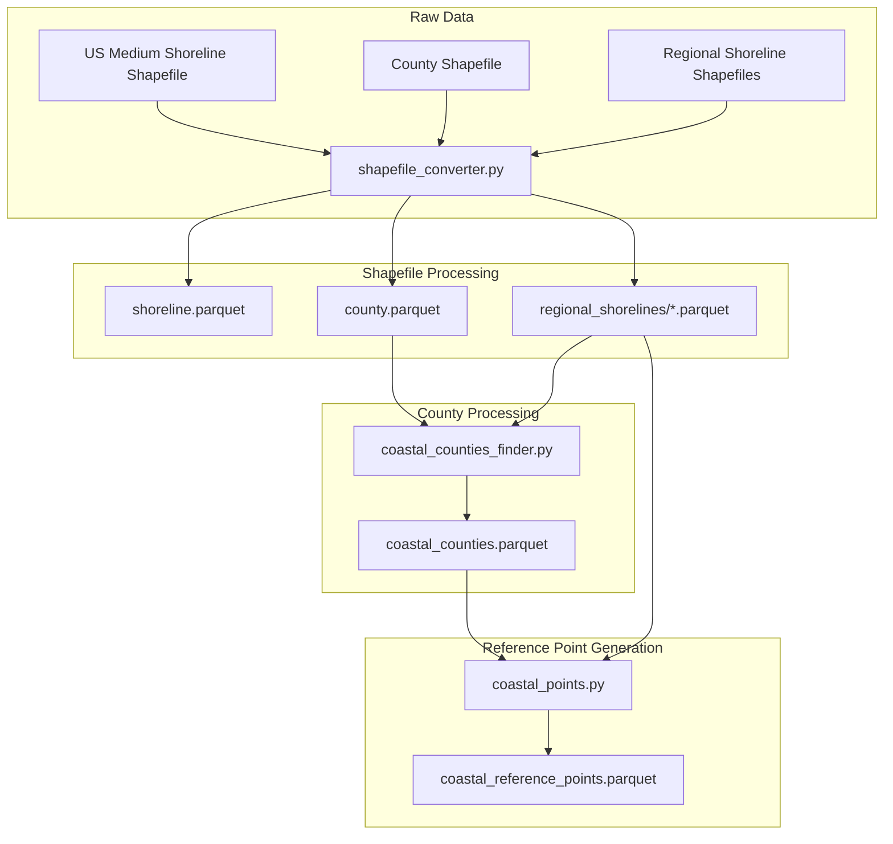
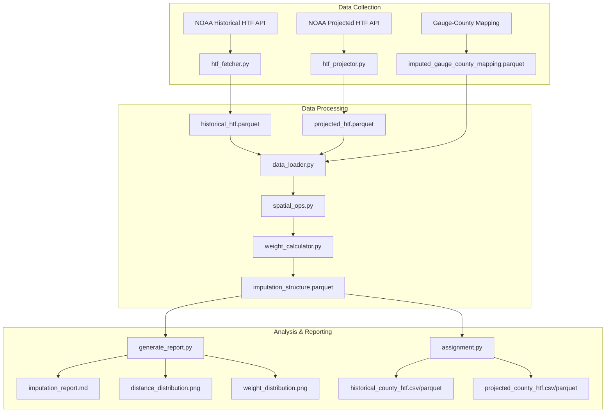

# County-Level High Tide Flooding Analysis

This project processes NOAA's High Tide Flooding (HTF) data to create county-level estimates of both historical flooding events and future flooding projections. It combines gauge-level measurements with spatial relationships between tide gauges and counties to generate weighted estimates of flooding frequency for coastal counties.


## Preprocessing Pipeline



## Data Pipeline




## Data Products

The project generates two main datasets:

### 1. Historical County HTF Dataset
- **Description**: Observed high tide flooding events aggregated to county level
- **Time Range**: 1950-2022
- **Contents**: 
  - Flood day counts by severity (minor, moderate, major)
  - Total flood days per year
  - Coverage: 328 coastal counties
- **Location**: `data/processed/county_htf/`
  - CSV: `historical_county_htf.csv`
  - Parquet: `historical_county_htf.parquet`
  - Data Dictionary: `historical_county_htf_data_dictionary.md`

### 2. Projected County HTF Dataset
- **Description**: Projected future flooding frequency under different sea level rise scenarios
- **Time Range**: 2020-2100
- **Contents**:
  - Flood day projections for 5 scenarios:
    - Low
    - Intermediate Low
    - Intermediate
    - Intermediate High
    - High
  - Coverage: 328 coastal counties
- **Location**: `data/processed/county_htf/`
  - CSV: `projected_county_htf.csv`
  - Parquet: `projected_county_htf.parquet`
  - Data Dictionary: `projected_county_htf_data_dictionary.md`

## Data Sources

This analysis is based on two primary NOAA data products:

1. **Annual Flood Count Product**
   - Historical observations of high tide flooding events
   - Categorized by severity (minor, moderate, major)
   - Collected at NOAA tide gauge stations

2. **Decadal Projections Product**
   - Future flooding frequency estimates
   - Multiple sea level rise scenarios
   - Based on NOAA tide gauge locations

## Methodology

The county-level estimates are generated through the following process:

1. **Gauge-County Mapping**
   - Each county is associated with up to 3 nearest tide gauges
   - Weights are assigned based on proximity and other relevant factors
   - Stored in: `data/processed/imputed_gauge_county_mapping.parquet`

2. **Data Processing**
   - Historical and projected data are processed separately
   - Gauge measurements are weighted and aggregated to county level
   - Quality checks ensure data completeness and validity

3. **Output Generation**
   - Results saved in both CSV (for sharing) and Parquet (for analysis)
   - Comprehensive data dictionaries document all fields
   - Summary statistics included for data validation

## Usage

To process the HTF data and generate county-level datasets:

```bash
python3 -m src.county_htf.main
```

This will:
1. Load gauge-county mapping and HTF data
2. Process historical observations
3. Process future projections
4. Generate output files and data dictionaries

## Project Structure

```
.
├── data/
│   └── processed/
│       ├── county_htf/          # Output datasets
│       ├── historical_htf/      # Input historical data
│       ├── projected_htf/       # Input projected data
│       └── imputed_gauge_county_mapping.parquet
├── src/
│   ├── imputation/
│   │   ├── __init__.py
│   │   ├── main.py             # Main imputation pipeline
│   │   ├── data_loader.py      # Data loading utilities
│   │   ├── spatial_ops.py      # Spatial operations and gauge finding
│   │   ├── weight_calculator.py # Weight calculation for gauges
│   │   └── generate_report.py  # Report generation module
│   └── county_htf/
│       ├── __init__.py
│       ├── main.py             # County HTF processing pipeline
│       ├── data_loader.py      # Data loading utilities
│       └── assignment.py       # Core processing logic
├── output/
│   └── imputation/
│       ├── imputation_report.md     # Analysis report
│       ├── distance_distribution.png # Distance visualization
│       └── weight_distribution.png   # Weight visualization
└── README.md
```

## Data Quality Notes

- Some counties may have fewer than three associated gauges
- Flood day counts are weighted averages and may include fractional days
- Historical data represents actual observations while projections are model-based estimates
- Two counties (13073 and 45037) have no gauge data and are excluded from the results

## Documentation

For more information about the source data and methodology, refer to:
- [NOAA HTF Documentation](https://tidesandcurrents.noaa.gov/publications/HTF_Notice_of_Methodology_Update_2023.pdf)
- Data dictionaries in the output directory 