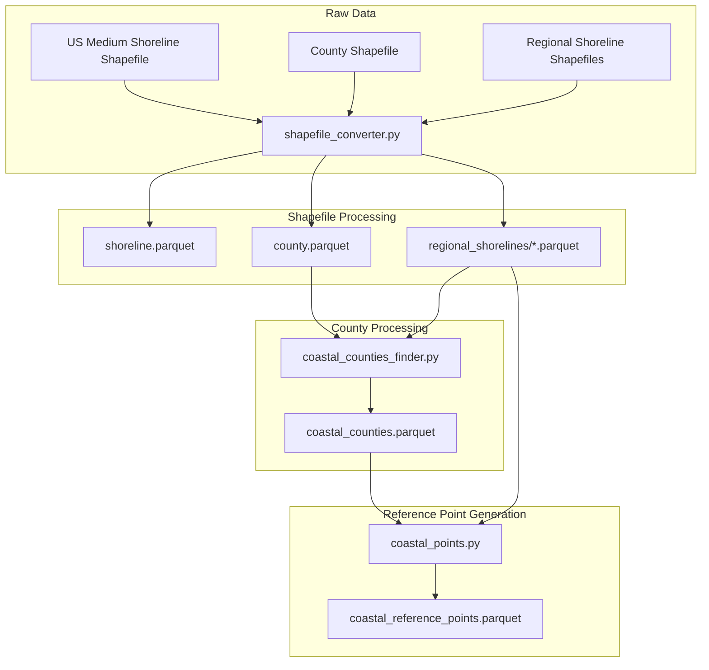
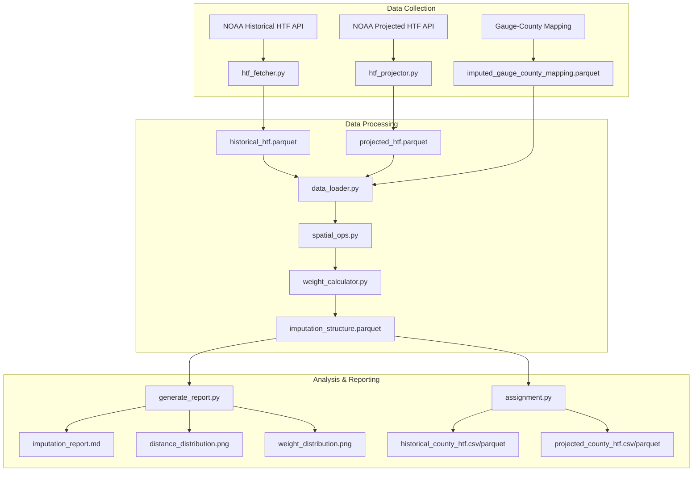

# County-Level Tidal Flooding Data Processing

A Python package for retrieving and processing NOAA high tide flooding (HTF) data at the county level. This package provides tools for both historical data analysis and future projections.

## Features

- **Historical Data Processing**
  - Fetch historical high tide flooding data from NOAA
  - Process data by region with quality control checks
  - Aggregate data at county/regional level
  - Export processed data in CSV or Parquet format

- **Projected Data Processing**
  - Fetch projected high tide flooding data from NOAA
  - Process projections by region and scenario
  - Support for multiple climate scenarios
  - Export processed data in CSV or Parquet format

- **Core Infrastructure**
  - Efficient API client with rate limiting
  - Robust caching system
  - Configurable by region and data type
  - Error handling and logging

## Installation

1. Clone the repository:
```bash
git clone https://github.com/yourusername/county_level_tidal_flooding.git
cd county_level_tidal_flooding
```

2. Create a virtual environment (optional but recommended):
```bash
python -m venv venv
source venv/bin/activate  # On Windows: venv\Scripts\activate
```

3. Install dependencies:
```bash
pip install -r requirements.txt
```

## Configuration

The package uses YAML configuration files located in the `config` directory:

- `noaa_settings.yaml`: NOAA API settings and data type configurations
- `fips_mappings.yaml`: Region and county FIPS code mappings
- `{region}_tide_stations.yaml`: Region-specific tide station configurations

### Regional Configurations

Each region has its own configuration file that defines:
- Tide station locations (latitude/longitude)
- Station names and identifiers
- Regional groupings/classifications
- Coverage areas

Supported Regions:
- Alaska (`alaska_tide_stations.yaml`)
- Hawaii (`hawaii_tide_stations.yaml`)
- Pacific Islands (`pacific_islands_tide_stations.yaml`)
- Virgin Islands (`virgin_islands_tide_stations.yaml`)
- Puerto Rico (`puerto_rico_tide_stations.yaml`)
- Mid-Atlantic (`mid_atlantic_tide_stations.yaml`)
- North Atlantic (`north_atlantic_tide_stations.yaml`)
- South Atlantic (`south_atlantic_tide_stations.yaml`)
- Gulf Coast (`gulf_coast_tide_stations.yaml`)
- West Coast (`west_coast_tide_stations.yaml`)

## Usage

### Historical Data Processing

Process historical HTF data for a specific region:

```bash
python -m noaa.historical.historical_htf_cli \
    --region alaska \
    --start-year 2000 \
    --end-year 2022 \
    --output-dir output/historical \
    --format parquet
```

### Projected Data Processing

Process projected HTF data for a specific region:

```bash
python -m noaa.projected.projected_htf_cli \
    --region hawaii \
    --start-decade 2020 \
    --end-decade 2100 \
    --output-dir output/projected \
    --format parquet
```

### Common Arguments

Both CLI tools support the following arguments:

- `--region`: Region to process (required)
- `--output-dir`: Output directory for processed data
- `--config-dir`: Custom config directory path
- `--format`: Output format (csv or parquet)
- `--verbose`: Enable verbose logging

## Output Format

### Historical Data

The processed historical data includes:
- Station ID
- Year
- Number of flood days
- Number of missing days
- Region identifier

### Projected Data

The projected data includes:
- Station ID
- Decade
- Scenario (e.g., intermediate, intermediate-high)
- Projected flood days
- Region identifier

## Development

### Project Structure

```
county_level_tidal_flooding/
├── config/                           # Configuration files
│   ├── tide-stations-list.yaml      # Master station list
│   ├── fips_mappings.yaml           # County FIPS mappings
│   ├── noaa_settings.yaml           # NOAA API settings
│   └── *_tide_stations.yaml         # Regional configurations
├── data/
│   ├── raw/
│   │   ├── shapefile_county/        # County boundaries
│   │   └── shapefile_shoreline/     # Shoreline data
│   └── cache/                       # NOAA API response cache
│       ├── historical/              # Historical data cache
│       └── projected/               # Projected data cache
├── src/
│   └── noaa/
│       ├── core/
│       │   ├── __init__.py
│       │   ├── noaa_client.py
│       │   ├── rate_limiter.py
│       │   └── cache_manager.py
│       ├── historical/
│       │   ├── __init__.py
│       │   ├── historical_htf_cli.py
│       │   ├── historical_htf_fetcher.py
│       │   └── historical_htf_processor.py
│       └── projected/
│           ├── __init__.py
│           ├── projected_htf_cli.py
│           ├── projected_htf_fetcher.py
│           └── projected_htf_processor.py
├── README.md
└── requirements.txt
```

### Contributing

1. Fork the repository
2. Create a feature branch
3. Make your changes
4. Run tests
5. Submit a pull request

## Analysis Pipeline

The analysis proceeds along two parallel tracks:

### Historical HTF Analysis
1. Processing historical HTF observations by region
   - Data structure: Annual counts of minor flooding events
   - Time range: 1950-2022
   - Source: NOAA Annual Flood Count Product (minor flooding only)
2. Developing region-specific imputation strategies for historical data
3. Generating county-level historical estimates
   - Output: Annual minor flooding frequency by county
   - Quality metrics for historical coverage

### Projected HTF Analysis
1. Processing projected HTF data by region
   - Data structure: Decadal flooding frequency projections
   - Time range: 2020-2100
   - Source: NOAA Decadal Projections Product
   - Multiple sea level rise scenarios (low to high)
2. Developing region-specific imputation strategies for projections
3. Generating county-level projections
   - Output: Projected flooding frequency by county
   - Separate outputs for each sea level rise scenario
   - Uncertainty quantification for projections

The separation into historical and projected analyses is necessary due to:
- Different data structures and temporal resolutions
- Distinct quality control requirements
- Different imputation strategies needed
- Separate uncertainty quantification approaches

## Original Pipeline Design (Archived)

This section documents the original pipeline design before we moved to a region-specific approach.

### Original Preprocessing Pipeline



### Original Data Pipeline



The original approach attempted to process all regions through a single pipeline. However, this proved problematic due to significant regional differences in:
- Gauge density and distribution
- Geographic scale and complexity
- Data quality and availability
- Physical oceanographic characteristics

This led to our current approach of starting with careful regional verification before proceeding with data processing.

## License

This project is licensed under the MIT License - see the LICENSE file for details. 