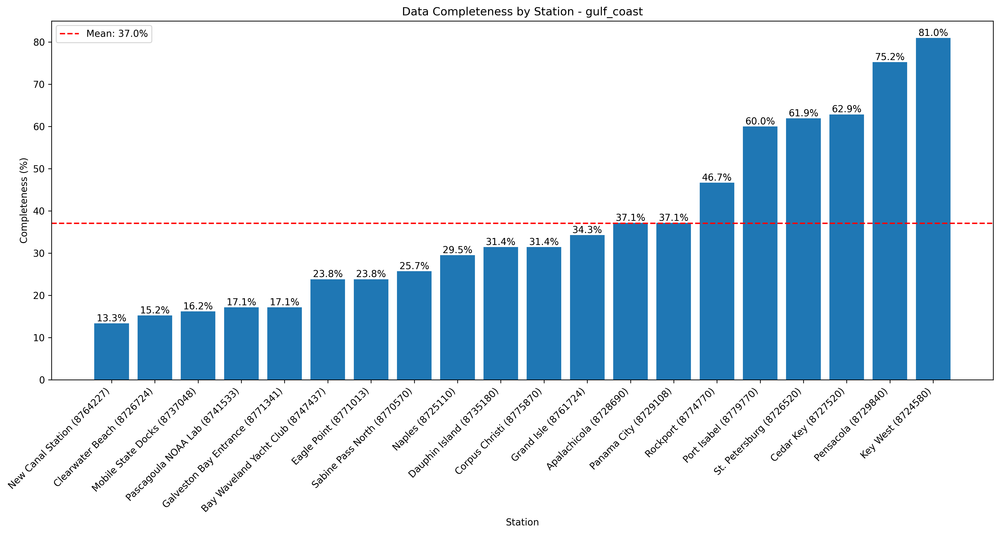
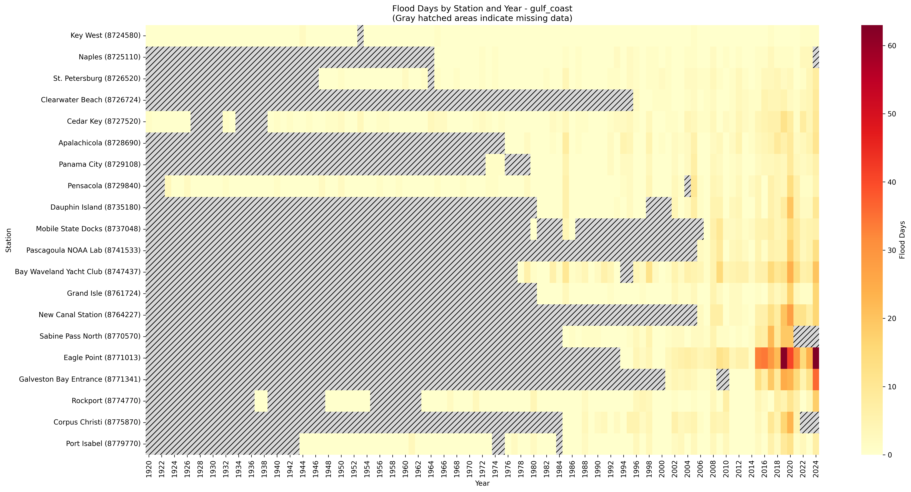
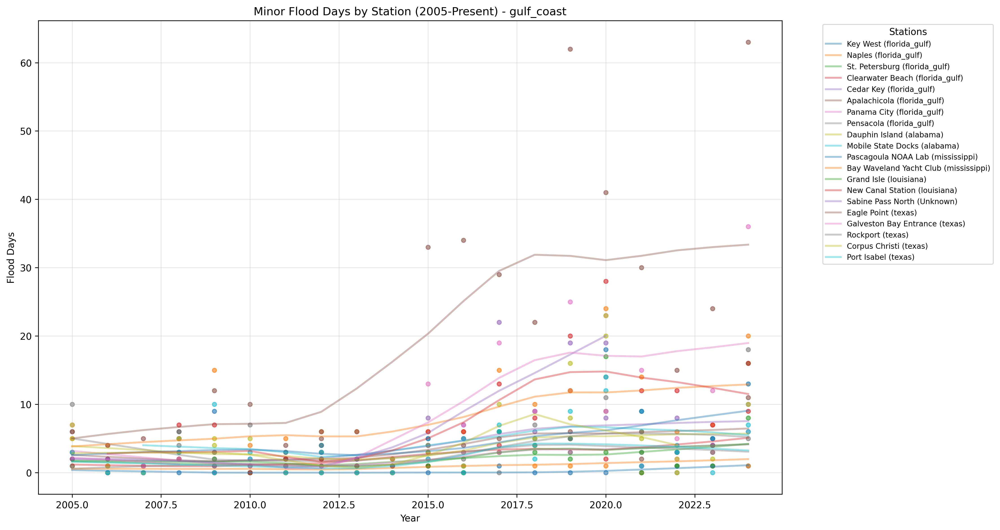

# High Tide Flooding Data Quality Analysis - gulf_coast

Analysis generated on: 2025-02-10 13:46:34

## Overview

Analysis of high tide flooding data from 1920 to 2024.

### Key Statistics

- Total records analyzed: 2100
- Average flood days per year (excluding missing data): 2.54
- Overall data completeness: 37.0%

### Monitoring Stations

| Station ID | Name | Location | Sub-Region | Data Completeness |
|------------|------|----------|------------|-------------------|
| 8724580 | Key West | 24.55°N, 81.81°W | florida_gulf | 81.0% |
| 8725110 | Naples | 26.13°N, 81.81°W | florida_gulf | 29.5% |
| 8726520 | St. Petersburg | 27.76°N, 82.63°W | florida_gulf | 61.9% |
| 8726724 | Clearwater Beach | 27.98°N, 82.83°W | florida_gulf | 15.2% |
| 8727520 | Cedar Key | 29.14°N, 83.03°W | florida_gulf | 62.9% |
| 8728690 | Apalachicola | 29.73°N, 84.98°W | florida_gulf | 37.1% |
| 8729108 | Panama City | 30.15°N, 85.67°W | florida_gulf | 37.1% |
| 8729840 | Pensacola | 30.40°N, 87.21°W | florida_gulf | 75.2% |
| 8735180 | Dauphin Island | 30.25°N, 88.08°W | alabama | 31.4% |
| 8737048 | Mobile State Docks | 30.70°N, 88.04°W | alabama | 16.2% |
| 8741533 | Pascagoula NOAA Lab | 30.37°N, 88.56°W | mississippi | 17.1% |
| 8747437 | Bay Waveland Yacht Club | 30.33°N, 89.33°W | mississippi | 23.8% |
| 8760721 | Pilottown | 29.18°N, 89.26°W | louisiana | 0.0% |
| 8761724 | Grand Isle | 29.26°N, 89.96°W | louisiana | 34.3% |
| 8764227 | New Canal Station | 30.03°N, 90.11°W | louisiana | 13.3% |
| 8770570 | Sabine Pass North | 29.73°N, 93.87°W | Unknown | 25.7% |
| 8771013 | Eagle Point | 29.48°N, 94.92°W | texas | 23.8% |
| 8771341 | Galveston Bay Entrance | 29.36°N, 94.72°W | texas | 17.1% |
| 8772447 | Freeport | 28.94°N, 95.30°W | texas | 0.0% |
| 8774770 | Rockport | 28.02°N, 97.05°W | texas | 46.7% |
| 8775870 | Corpus Christi | 27.58°N, 97.22°W | texas | 31.4% |
| 8779770 | Port Isabel | 26.06°N, 97.22°W | texas | 60.0% |

## Data Quality Analysis

### Data Completeness by Station

This visualization shows the percentage of days with valid data for each station:
- Stations are ordered by completeness percentage
- The red line indicates the regional mean completeness
- Regional mean completeness: 37.0%

### Flood Days Distribution

This heatmap shows the distribution of flood days across stations and years:
- Color intensity indicates number of flood days
- Gray hatched areas indicate missing data (>180 days missing in that year)
- White indicates zero flood days with complete data

### Recent Flooding Trends (2005-Present)

This plot shows the trend in minor flood days for each station since 2005:
- Each line represents a different monitoring station
- Points indicate actual measurements
- Gaps in lines indicate missing data

## Key Findings

### Most Complete Records

- Key West (florida_gulf, Station 8724580): 81.0% complete
- Pensacola (florida_gulf, Station 8729840): 75.2% complete
- Cedar Key (florida_gulf, Station 8727520): 62.9% complete

### Highest Flooding Activity

- Eagle Point (texas, Station 8771013): 14.20 flood days per year
- Galveston Bay Entrance (texas, Station 8771341): 10.00 flood days per year
- New Canal Station (louisiana, Station 8764227): 9.43 flood days per year

