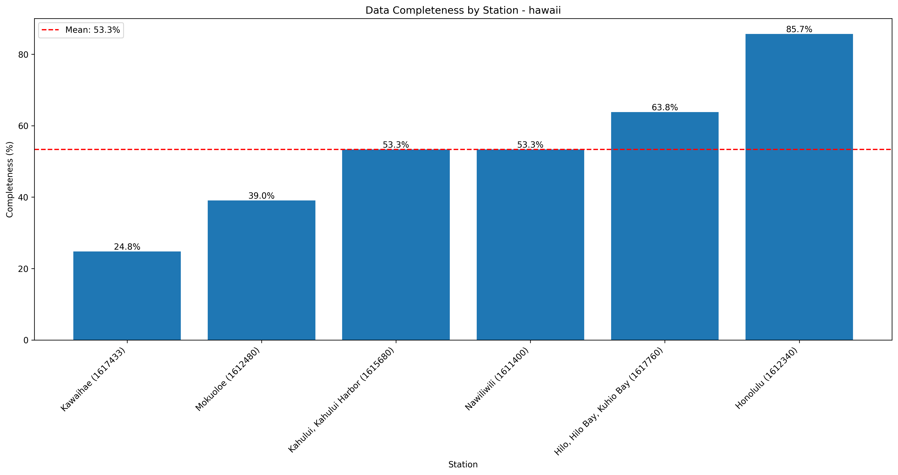
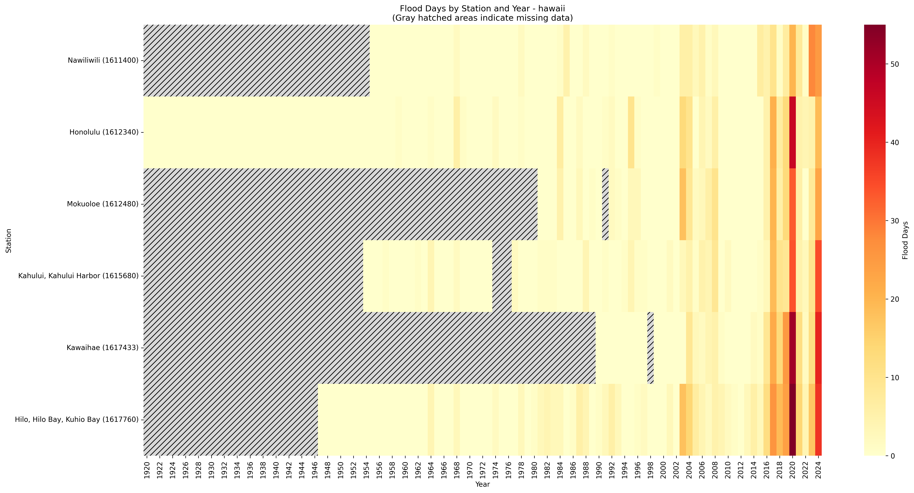
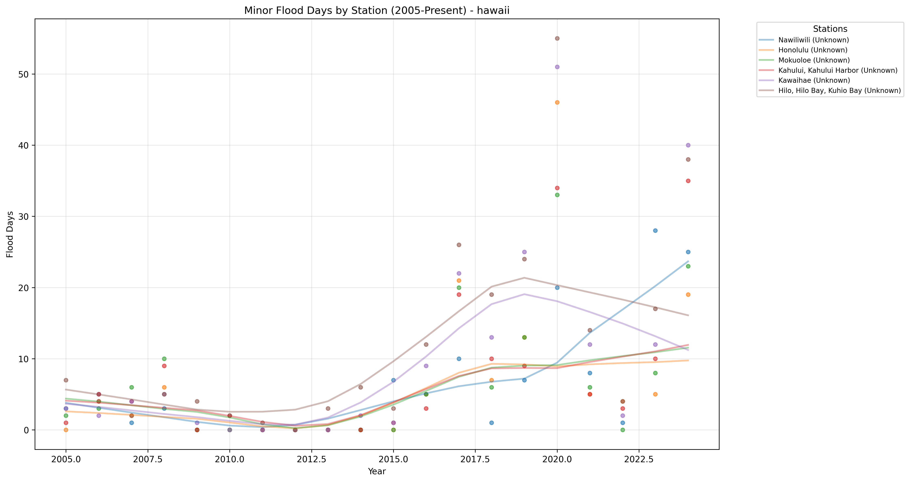

# High Tide Flooding Data Quality Analysis - hawaii

Analysis generated on: 2025-02-10 13:55:29

## Overview

Analysis of high tide flooding data from 1920 to 2024.

### Key Statistics

- Total records analyzed: 630
- Average flood days per year (excluding missing data): 3.61
- Overall data completeness: 53.3%

### Monitoring Stations

| Station ID | Name | Location | Sub-Region | Data Completeness |
|------------|------|----------|------------|-------------------|
| 1611400 | Nawiliwili | 21.95°N, 159.36°W | Unknown | 53.3% |
| 1612340 | Honolulu | 21.30°N, 157.86°W | Unknown | 85.7% |
| 1612401 | Pearl Harbor | 21.37°N, 157.96°W | Unknown | 0.0% |
| 1612480 | Mokuoloe | 21.43°N, 157.79°W | Unknown | 39.0% |
| 1615680 | Kahului, Kahului Harbor | 20.89°N, 156.47°W | Unknown | 53.3% |
| 1617433 | Kawaihae | 20.04°N, 155.83°W | Unknown | 24.8% |
| 1617760 | Hilo, Hilo Bay, Kuhio Bay | 19.73°N, 155.06°W | Unknown | 63.8% |

## Data Quality Analysis

### Data Completeness by Station

This visualization shows the percentage of days with valid data for each station:
- Stations are ordered by completeness percentage
- The red line indicates the regional mean completeness
- Regional mean completeness: 53.3%

### Flood Days Distribution

This heatmap shows the distribution of flood days across stations and years:
- Color intensity indicates number of flood days
- Gray hatched areas indicate missing data (>180 days missing in that year)
- White indicates zero flood days with complete data

### Recent Flooding Trends (2005-Present)

This plot shows the trend in minor flood days for each station since 2005:
- Each line represents a different monitoring station
- Points indicate actual measurements
- Gaps in lines indicate missing data

## Key Findings

### Most Complete Records

- Honolulu (Unknown, Station 1612340): 85.7% complete
- Hilo, Hilo Bay, Kuhio Bay (Unknown, Station 1617760): 63.8% complete
- Nawiliwili (Unknown, Station 1611400): 53.3% complete

### Highest Flooding Activity

- Kawaihae (Unknown, Station 1617433): 7.96 flood days per year
- Hilo, Hilo Bay, Kuhio Bay (Unknown, Station 1617760): 4.87 flood days per year
- Mokuoloe (Unknown, Station 1612480): 4.15 flood days per year

