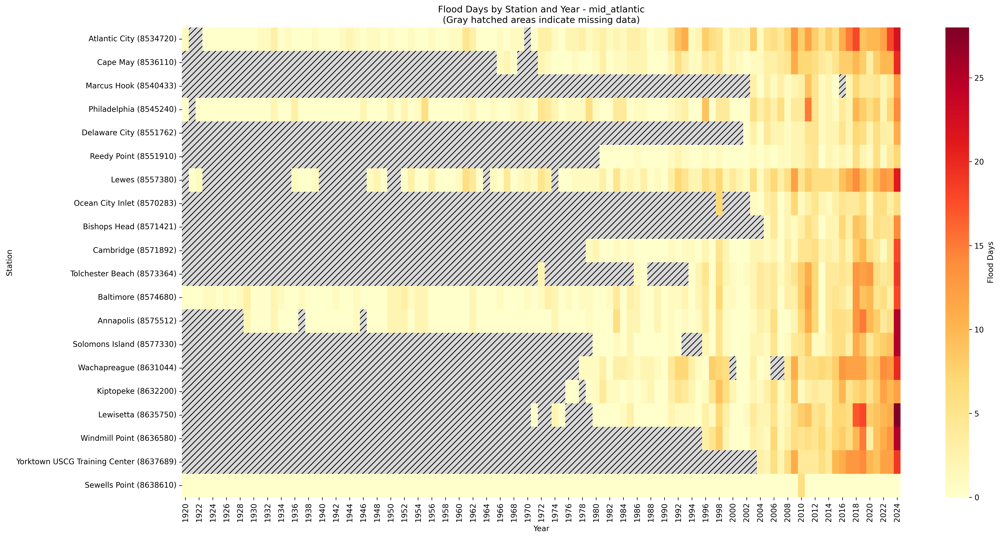
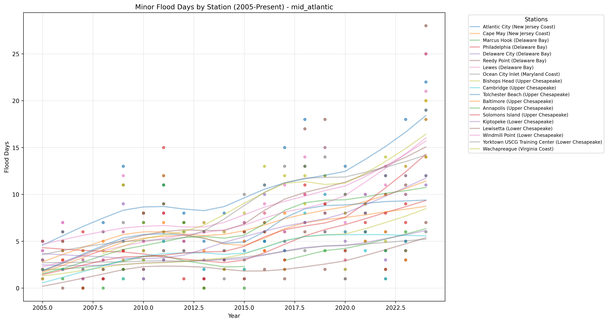

# High Tide Flooding Data Quality Analysis - mid_atlantic

Analysis generated on: 2025-02-10 13:49:50

## Overview

Analysis of high tide flooding data from 1920 to 2024.

### Key Statistics

- Total records analyzed: 1996
- Average flood days per year (excluding missing data): 3.58
- Overall data completeness: 39.7%

### Monitoring Stations

| Station ID | Name | Location | Sub-Region | Data Completeness |
|------------|------|----------|------------|-------------------|
| 8534720 | Atlantic City | 39.36°N, 74.42°W | New Jersey Coast | 81.0% |
| 8536110 | Cape May | 38.97°N, 74.96°W | New Jersey Coast | 38.1% |
| 8537121 | Ship John Shoal | 39.31°N, 75.38°W | Delaware Bay | 0.0% |
| 8539094 | Burlington, Delaware River | 40.08°N, 74.87°W | Delaware Bay | 0.0% |
| 8540433 | Marcus Hook | 39.81°N, 75.41°W | Delaware Bay | 17.1% |
| 8545240 | Philadelphia | 39.93°N, 75.14°W | Delaware Bay | 78.1% |
| 8551762 | Delaware City | 39.58°N, 75.59°W | Delaware Bay | 19.0% |
| 8551910 | Reedy Point | 39.56°N, 75.57°W | Delaware Bay | 29.5% |
| 8555889 | Brandywine Shoal Light | 38.99°N, 75.11°W | Delaware Bay | 0.0% |
| 8557380 | Lewes | 38.78°N, 75.12°W | Delaware Bay | 61.0% |
| 8570283 | Ocean City Inlet | 38.33°N, 75.09°W | Maryland Coast | 21.0% |
| 8571421 | Bishops Head | 38.22°N, 76.04°W | Upper Chesapeake | 12.4% |
| 8571892 | Cambridge | 38.57°N, 76.06°W | Upper Chesapeake | 38.1% |
| 8573364 | Tolchester Beach | 39.21°N, 76.24°W | Upper Chesapeake | 22.9% |
| 8574680 | Baltimore | 39.27°N, 76.58°W | Upper Chesapeake | 87.6% |
| 8575512 | Annapolis | 38.98°N, 76.48°W | Upper Chesapeake | 67.6% |
| 8577330 | Solomons Island | 38.32°N, 76.45°W | Upper Chesapeake | 34.3% |
| 8632200 | Kiptopeke | 37.17°N, 75.99°W | Lower Chesapeake | 41.0% |
| 8635750 | Lewisetta | 38.00°N, 76.47°W | Lower Chesapeake | 38.1% |
| 8636580 | Windmill Point | 37.62°N, 76.29°W | Lower Chesapeake | 22.9% |
| 8637689 | Yorktown USCG Training Center | 37.23°N, 76.48°W | Lower Chesapeake | 18.1% |
| 8638610 | Sewells Point | 36.94°N, 76.33°W | Lower Chesapeake | 100.0% |
| 8638901 | CBBT, Chesapeake Channel | 37.03°N, 76.08°W | Lower Chesapeake | 0.0% |
| 8631044 | Wachapreague | 37.61°N, 75.69°W | Virginia Coast | 26.7% |

## Data Quality Analysis

### Data Completeness by Station

This visualization shows the percentage of days with valid data for each station:
- Stations are ordered by completeness percentage
- The red line indicates the regional mean completeness
- Regional mean completeness: 42.7%

### Flood Days Distribution

This heatmap shows the distribution of flood days across stations and years:
- Color intensity indicates number of flood days
- Gray hatched areas indicate missing data (>180 days missing in that year)
- White indicates zero flood days with complete data

### Recent Flooding Trends (2005-Present)

This plot shows the trend in minor flood days for each station since 2005:
- Each line represents a different monitoring station
- Points indicate actual measurements
- Gaps in lines indicate missing data

## Key Findings

### Most Complete Records

- Sewells Point (Lower Chesapeake, Station 8638610): 100.0% complete
- Baltimore (Upper Chesapeake, Station 8574680): 87.6% complete
- Atlantic City (New Jersey Coast, Station 8534720): 81.0% complete

### Highest Flooding Activity

- Yorktown USCG Training Center (Lower Chesapeake, Station 8637689): 8.95 flood days per year
- Windmill Point (Lower Chesapeake, Station 8636580): 6.79 flood days per year
- Wachapreague (Virginia Coast, Station 8631044): 6.25 flood days per year

