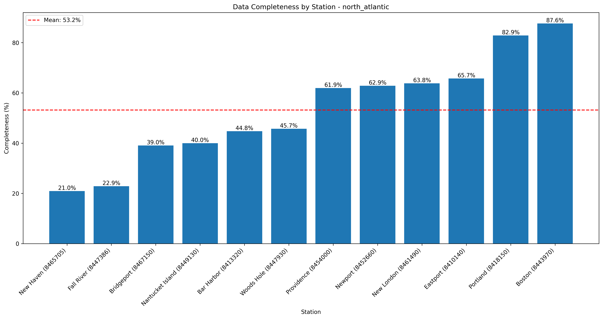
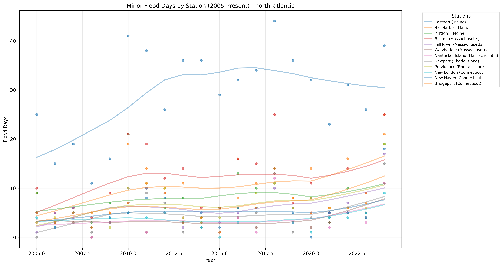

# High Tide Flooding Data Quality Analysis - north_atlantic

Analysis generated on: 2025-02-10 13:51:33

## Overview

Analysis of high tide flooding data from 1920 to 2024.

### Key Statistics

- Total records analyzed: 1260
- Average flood days per year (excluding missing data): 4.81
- Overall data completeness: 53.2%

### Monitoring Stations

| Station ID | Name | Location | Sub-Region | Data Completeness |
|------------|------|----------|------------|-------------------|
| 8410140 | Eastport | 44.90°N, 66.98°W | Maine | 65.7% |
| 8411060 | Cutler Farris Wharf | 44.66°N, 67.21°W | Maine | 0.0% |
| 8413320 | Bar Harbor | 44.39°N, 68.20°W | Maine | 44.8% |
| 8418150 | Portland | 43.66°N, 70.24°W | Maine | 82.9% |
| 8419870 | Seavey Island | 43.08°N, 70.74°W | New Hampshire | 0.0% |
| 8443970 | Boston | 42.35°N, 71.05°W | Massachusetts | 87.6% |
| 8447386 | Fall River | 41.70°N, 71.16°W | Massachusetts | 22.9% |
| 8447435 | Chatham | 41.69°N, 69.95°W | Massachusetts | 0.0% |
| 8447930 | Woods Hole | 41.52°N, 70.67°W | Massachusetts | 45.7% |
| 8449130 | Nantucket Island | 41.28°N, 70.10°W | Massachusetts | 40.0% |
| 8452660 | Newport | 41.50°N, 71.33°W | Rhode Island | 62.9% |
| 8454000 | Providence | 41.81°N, 71.40°W | Rhode Island | 61.9% |
| 8461490 | New London | 41.37°N, 72.10°W | Connecticut | 63.8% |
| 8465705 | New Haven | 41.28°N, 72.91°W | Connecticut | 21.0% |
| 8467150 | Bridgeport | 41.18°N, 73.18°W | Connecticut | 39.0% |

## Data Quality Analysis

### Data Completeness by Station

This visualization shows the percentage of days with valid data for each station:
- Stations are ordered by completeness percentage
- The red line indicates the regional mean completeness
- Regional mean completeness: 53.2%

### Flood Days Distribution

This heatmap shows the distribution of flood days across stations and years:
- Color intensity indicates number of flood days
- Gray hatched areas indicate missing data (>180 days missing in that year)
- White indicates zero flood days with complete data

### Recent Flooding Trends (2005-Present)

This plot shows the trend in minor flood days for each station since 2005:
- Each line represents a different monitoring station
- Points indicate actual measurements
- Gaps in lines indicate missing data

## Key Findings

### Most Complete Records

- Boston (Massachusetts, Station 8443970): 87.6% complete
- Portland (Maine, Station 8418150): 82.9% complete
- Eastport (Maine, Station 8410140): 65.7% complete

### Highest Flooding Activity

- Eastport (Maine, Station 8410140): 17.17 flood days per year
- Bar Harbor (Maine, Station 8413320): 5.49 flood days per year
- Fall River (Massachusetts, Station 8447386): 5.25 flood days per year

