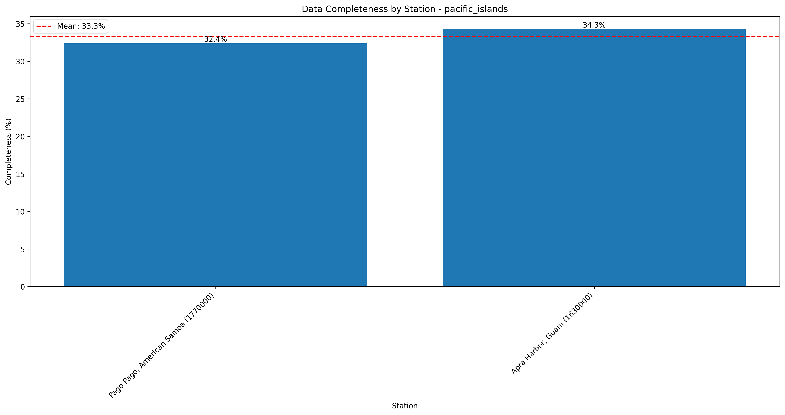
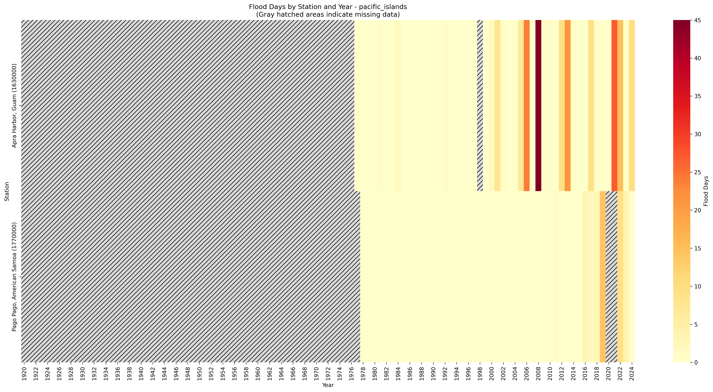
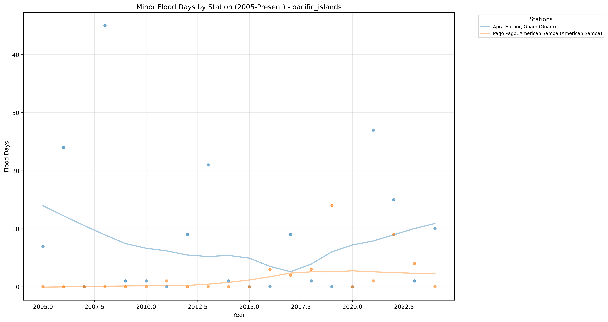

# High Tide Flooding Data Quality Analysis - pacific_islands

Analysis generated on: 2025-02-10 13:56:47

## Overview

Analysis of high tide flooding data from 1920 to 2024.

### Key Statistics

- Total records analyzed: 210
- Average flood days per year (excluding missing data): 3.07
- Overall data completeness: 33.3%

### Monitoring Stations

| Station ID | Name | Location | Sub-Region | Data Completeness |
|------------|------|----------|------------|-------------------|
| 1630000 | Apra Harbor, Guam | 13.44°N, 144.66°W | Guam | 34.3% |
| 1631428 | Pago Bay, Guam | 13.43°N, 144.80°W | Guam | 0.0% |
| 1632200 | Saipan, Northern Mariana Islands | 15.22°N, 145.74°W | Northern Mariana Islands | 0.0% |
| 1770000 | Pago Pago, American Samoa | -14.28°N, 170.69°W | American Samoa | 32.4% |

## Data Quality Analysis

### Data Completeness by Station

This visualization shows the percentage of days with valid data for each station:
- Stations are ordered by completeness percentage
- The red line indicates the regional mean completeness
- Regional mean completeness: 33.3%

### Flood Days Distribution

This heatmap shows the distribution of flood days across stations and years:
- Color intensity indicates number of flood days
- Gray hatched areas indicate missing data (>180 days missing in that year)
- White indicates zero flood days with complete data

### Recent Flooding Trends (2005-Present)

This plot shows the trend in minor flood days for each station since 2005:
- Each line represents a different monitoring station
- Points indicate actual measurements
- Gaps in lines indicate missing data

## Key Findings

### Most Complete Records

- Apra Harbor, Guam (Guam, Station 1630000): 34.3% complete
- Pago Pago, American Samoa (American Samoa, Station 1770000): 32.4% complete

### Highest Flooding Activity

- Apra Harbor, Guam (Guam, Station 1630000): 4.97 flood days per year
- Pago Pago, American Samoa (American Samoa, Station 1770000): 1.06 flood days per year

