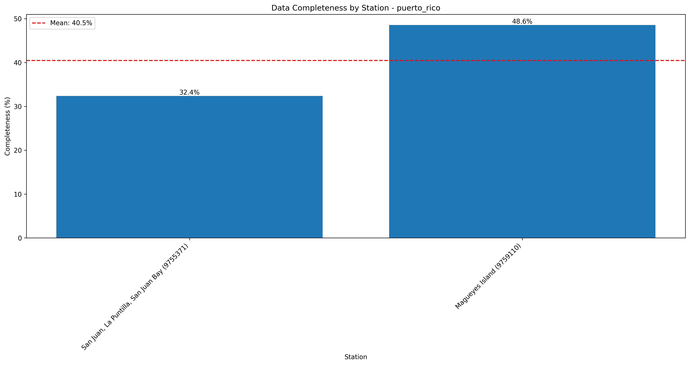
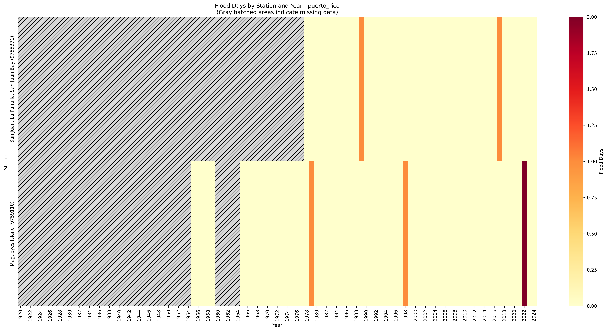

# High Tide Flooding Data Quality Analysis - puerto_rico

Analysis generated on: 2025-02-10 13:58:12

## Overview

Analysis of high tide flooding data from 1920 to 2024.

### Key Statistics

- Total records analyzed: 210
- Average flood days per year (excluding missing data): 0.05
- Overall data completeness: 40.5%

### Monitoring Stations

| Station ID | Name | Location | Sub-Region | Data Completeness |
|------------|------|----------|------------|-------------------|
| 9752235 | Culebra | 18.30°N, 65.30°W | East | 0.0% |
| 9752621 | Isabel Segunda, Vieques Island | 18.15°N, 65.44°W | East | 0.0% |
| 9752695 | Esperanza, Vieques Island | 18.09°N, 65.47°W | East | 0.0% |
| 9753216 | Fajardo | 18.34°N, 65.63°W | East | 0.0% |
| 9754229 | Yabucoa Harbor | 18.06°N, 65.83°W | East | 0.0% |
| 9755371 | San Juan, La Puntilla, San Juan Bay | 18.46°N, 66.12°W | North | 32.4% |
| 9757811 | Arecibo | 18.48°N, 66.70°W | North | 0.0% |
| 9755968 | Salinas, Bahia de Jobos | 17.95°N, 66.23°W | South | 0.0% |
| 9758066 | Guayanilla, Bahia de Guayanilla | 18.01°N, 66.77°W | South | 0.0% |
| 9759110 | Magueyes Island | 17.97°N, 67.05°W | South | 48.6% |
| 9759394 | Mayaguez | 18.22°N, 67.16°W | West | 0.0% |
| 9759413 | Aguadilla, Crashboat Beach | 18.46°N, 67.16°W | West | 0.0% |
| 9759938 | Mona Island | 18.09°N, 67.94°W | Offshore | 0.0% |

## Data Quality Analysis

### Data Completeness by Station

This visualization shows the percentage of days with valid data for each station:
- Stations are ordered by completeness percentage
- The red line indicates the regional mean completeness
- Regional mean completeness: 40.5%

### Flood Days Distribution

This heatmap shows the distribution of flood days across stations and years:
- Color intensity indicates number of flood days
- Gray hatched areas indicate missing data (>180 days missing in that year)
- White indicates zero flood days with complete data

### Recent Flooding Trends (2005-Present)

This plot shows the trend in minor flood days for each station since 2005:
- Each line represents a different monitoring station
- Points indicate actual measurements
- Gaps in lines indicate missing data

## Key Findings

### Most Complete Records

- Magueyes Island (South, Station 9759110): 48.6% complete
- San Juan, La Puntilla, San Juan Bay (North, Station 9755371): 32.4% complete

### Highest Flooding Activity

- Magueyes Island (South, Station 9759110): 0.06 flood days per year
- San Juan, La Puntilla, San Juan Bay (North, Station 9755371): 0.03 flood days per year

