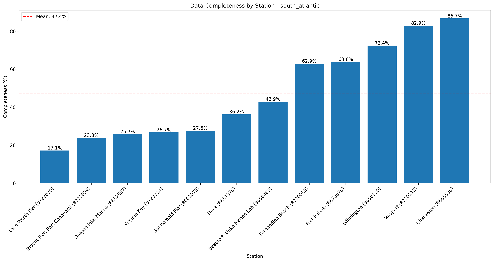
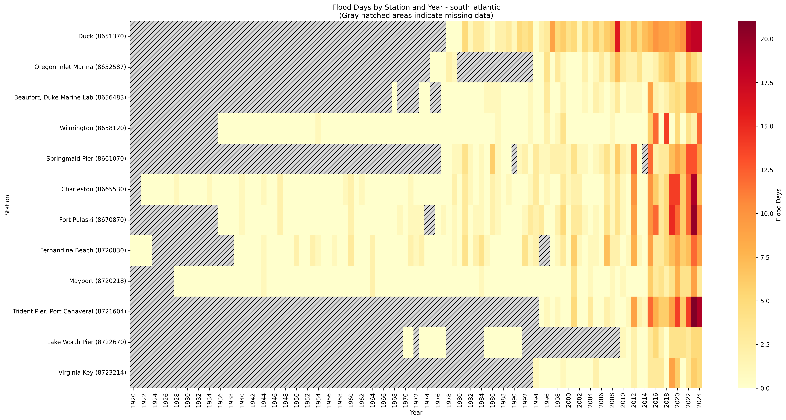
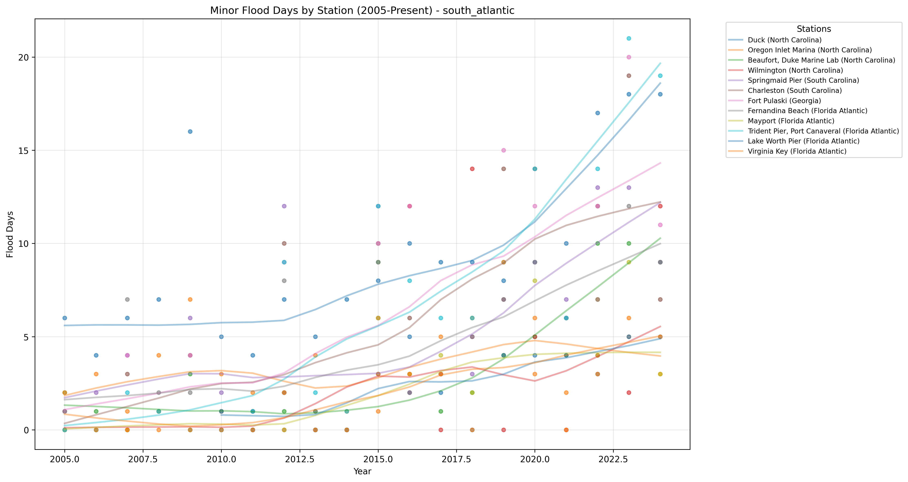

# High Tide Flooding Data Quality Analysis - south_atlantic

Analysis generated on: 2025-02-10 13:47:07

## Overview

Analysis of high tide flooding data from 1920 to 2024.

### Key Statistics

- Total records analyzed: 1260
- Average flood days per year (excluding missing data): 2.10
- Overall data completeness: 47.4%

### Monitoring Stations

| Station ID | Name | Location | Sub-Region | Data Completeness |
|------------|------|----------|------------|-------------------|
| 8651370 | Duck | 36.18°N, 75.75°W | North Carolina | 36.2% |
| 8652587 | Oregon Inlet Marina | 35.80°N, 75.55°W | North Carolina | 25.7% |
| 8654467 | USCG Station Hatteras | 35.21°N, 75.70°W | North Carolina | 0.0% |
| 8656483 | Beaufort, Duke Marine Lab | 34.72°N, 76.67°W | North Carolina | 42.9% |
| 8658120 | Wilmington | 34.23°N, 77.95°W | North Carolina | 72.4% |
| 8661070 | Springmaid Pier | 33.65°N, 78.92°W | South Carolina | 27.6% |
| 8665530 | Charleston | 32.77°N, 79.92°W | South Carolina | 86.7% |
| 8670870 | Fort Pulaski | 32.03°N, 80.90°W | Georgia | 63.8% |
| 8679598 | Kings Bay MSF Pier | 30.78°N, 81.49°W | Georgia | 0.0% |
| 8720030 | Fernandina Beach | 30.67°N, 81.47°W | Florida Atlantic | 62.9% |
| 8720218 | Mayport | 30.40°N, 81.43°W | Florida Atlantic | 82.9% |
| 8721604 | Trident Pier, Port Canaveral | 28.42°N, 80.59°W | Florida Atlantic | 23.8% |
| 8722670 | Lake Worth Pier | 26.61°N, 80.03°W | Florida Atlantic | 17.1% |
| 8723214 | Virginia Key | 25.73°N, 80.16°W | Florida Atlantic | 26.7% |

## Data Quality Analysis

### Data Completeness by Station

This visualization shows the percentage of days with valid data for each station:
- Stations are ordered by completeness percentage
- The red line indicates the regional mean completeness
- Regional mean completeness: 47.4%

### Flood Days Distribution

This heatmap shows the distribution of flood days across stations and years:
- Color intensity indicates number of flood days
- Gray hatched areas indicate missing data (>180 days missing in that year)
- White indicates zero flood days with complete data

### Recent Flooding Trends (2005-Present)

This plot shows the trend in minor flood days for each station since 2005:
- Each line represents a different monitoring station
- Points indicate actual measurements
- Gaps in lines indicate missing data

## Key Findings

### Most Complete Records

- Charleston (South Carolina, Station 8665530): 86.7% complete
- Mayport (Florida Atlantic, Station 8720218): 82.9% complete
- Wilmington (North Carolina, Station 8658120): 72.4% complete

### Highest Flooding Activity

- Duck (North Carolina, Station 8651370): 6.24 flood days per year
- Trident Pier, Port Canaveral (Florida Atlantic, Station 8721604): 5.12 flood days per year
- Springmaid Pier (South Carolina, Station 8661070): 3.90 flood days per year

