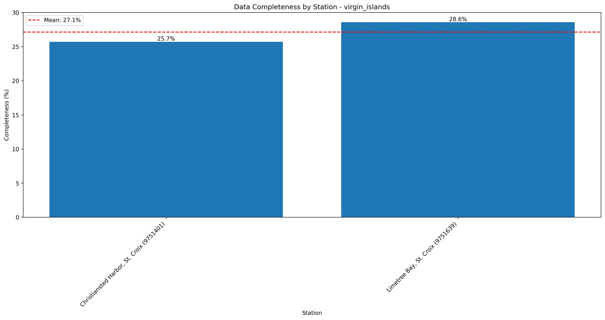
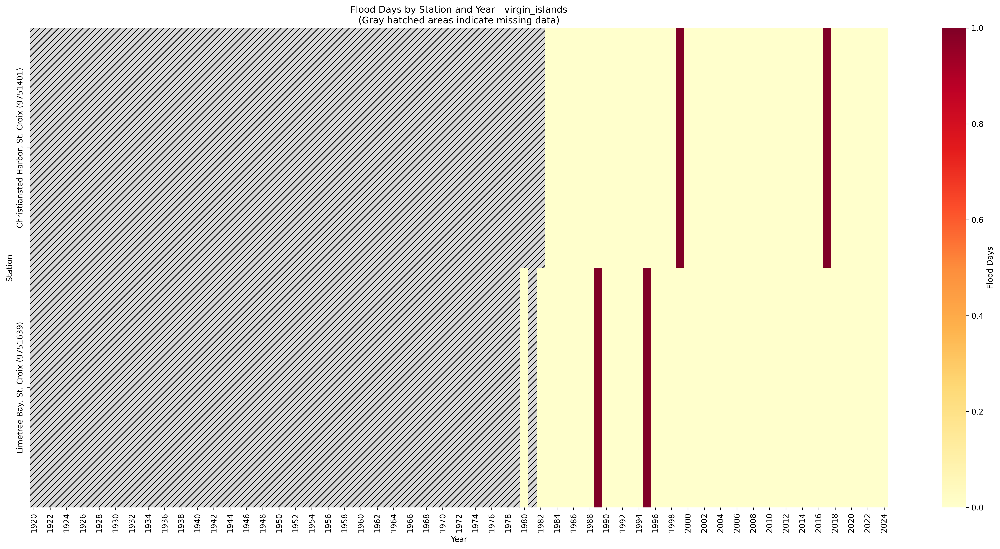
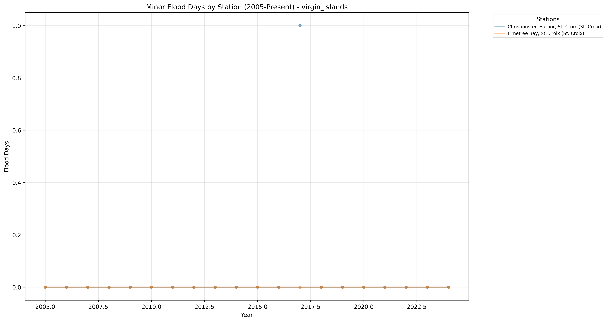

# High Tide Flooding Data Quality Analysis - virgin_islands

Analysis generated on: 2025-02-10 13:59:42

## Overview

Analysis of high tide flooding data from 1920 to 2024.

### Key Statistics

- Total records analyzed: 210
- Average flood days per year (excluding missing data): 0.05
- Overall data completeness: 27.1%

### Monitoring Stations

| Station ID | Name | Location | Sub-Region | Data Completeness |
|------------|------|----------|------------|-------------------|
| 9751309 | Water Bay, St. Thomas | 18.32°N, 64.86°W | St. Thomas | 0.0% |
| 9751364 | Charlotte Amalie, St. Thomas | 18.34°N, 64.92°W | St. Thomas | 0.0% |
| 9751381 | Lameshur Bay, St. John | 18.32°N, 64.72°W | St. John | 0.0% |
| 9751401 | Christiansted Harbor, St. Croix | 17.75°N, 64.70°W | St. Croix | 25.7% |
| 9751639 | Limetree Bay, St. Croix | 17.69°N, 64.75°W | St. Croix | 28.6% |

## Data Quality Analysis

### Data Completeness by Station

This visualization shows the percentage of days with valid data for each station:
- Stations are ordered by completeness percentage
- The red line indicates the regional mean completeness
- Regional mean completeness: 27.1%

### Flood Days Distribution

This heatmap shows the distribution of flood days across stations and years:
- Color intensity indicates number of flood days
- Gray hatched areas indicate missing data (>180 days missing in that year)
- White indicates zero flood days with complete data

### Recent Flooding Trends (2005-Present)

This plot shows the trend in minor flood days for each station since 2005:
- Each line represents a different monitoring station
- Points indicate actual measurements
- Gaps in lines indicate missing data

## Key Findings

### Most Complete Records

- Limetree Bay, St. Croix (St. Croix, Station 9751639): 28.6% complete
- Christiansted Harbor, St. Croix (St. Croix, Station 9751401): 25.7% complete

### Highest Flooding Activity

- Limetree Bay, St. Croix (St. Croix, Station 9751639): 0.07 flood days per year
- Christiansted Harbor, St. Croix (St. Croix, Station 9751401): 0.04 flood days per year

