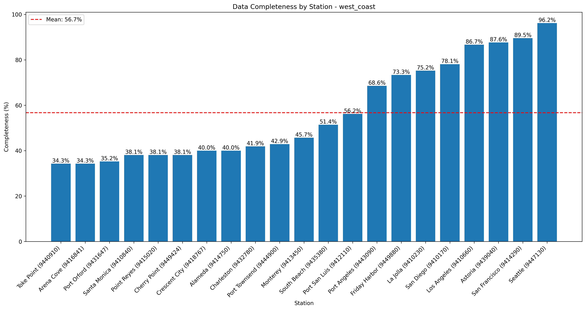
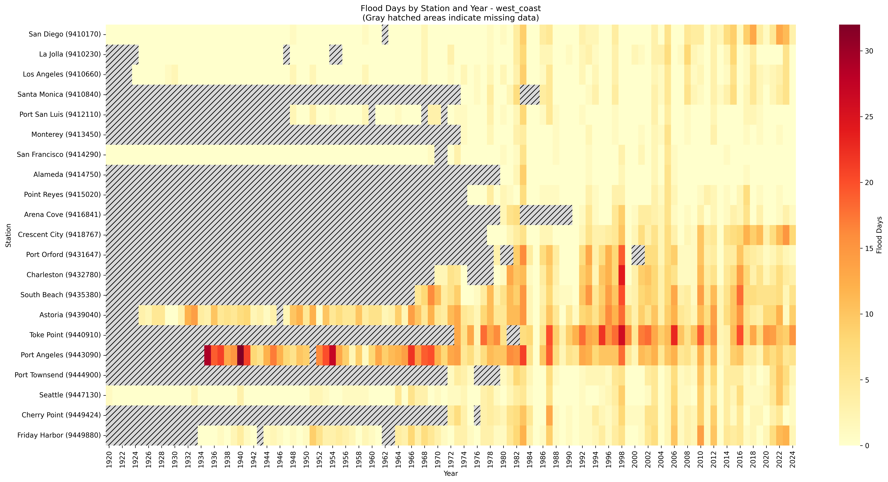
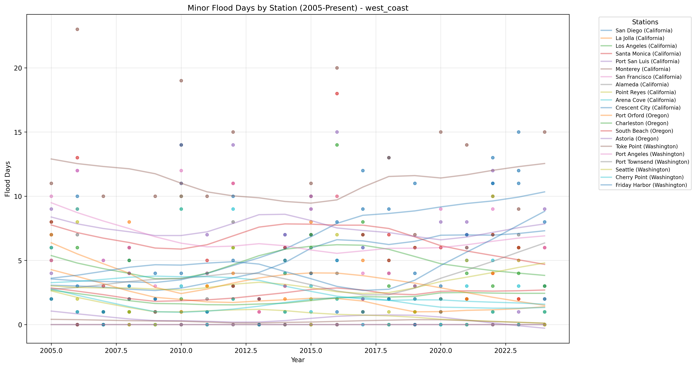

# High Tide Flooding Data Quality Analysis - west_coast

Analysis generated on: 2025-02-10 13:52:59

## Overview

Analysis of high tide flooding data from 1920 to 2024.

### Key Statistics

- Total records analyzed: 2205
- Average flood days per year (excluding missing data): 3.33
- Overall data completeness: 56.7%

### Monitoring Stations

| Station ID | Name | Location | Sub-Region | Data Completeness |
|------------|------|----------|------------|-------------------|
| 9410170 | San Diego | 32.71°N, 117.17°W | California | 78.1% |
| 9410230 | La Jolla | 32.87°N, 117.26°W | California | 75.2% |
| 9410660 | Los Angeles | 33.72°N, 118.27°W | California | 86.7% |
| 9410840 | Santa Monica | 34.01°N, 118.50°W | California | 38.1% |
| 9411340 | Santa Barbara | 34.41°N, 119.69°W | California | 0.0% |
| 9412110 | Port San Luis | 35.17°N, 120.75°W | California | 56.2% |
| 9413450 | Monterey | 36.60°N, 121.89°W | California | 45.7% |
| 9414290 | San Francisco | 37.81°N, 122.47°W | California | 89.5% |
| 9414750 | Alameda | 37.77°N, 122.30°W | California | 40.0% |
| 9415020 | Point Reyes | 38.00°N, 122.98°W | California | 38.1% |
| 9416841 | Arena Cove | 38.91°N, 123.71°W | California | 34.3% |
| 9418767 | Crescent City | 41.74°N, 124.18°W | California | 40.0% |
| 9431647 | Port Orford | 42.74°N, 124.50°W | Oregon | 35.2% |
| 9432780 | Charleston | 43.34°N, 124.32°W | Oregon | 41.9% |
| 9435380 | South Beach | 44.63°N, 124.04°W | Oregon | 51.4% |
| 9437540 | Garibaldi | 45.56°N, 123.92°W | Oregon | 0.0% |
| 9439040 | Astoria | 46.21°N, 123.77°W | Oregon | 87.6% |
| 9440910 | Toke Point | 46.71°N, 123.97°W | Washington | 34.3% |
| 9443090 | Port Angeles | 48.12°N, 123.44°W | Washington | 68.6% |
| 9444900 | Port Townsend | 48.11°N, 122.76°W | Washington | 42.9% |
| 9447130 | Seattle | 47.60°N, 122.34°W | Washington | 96.2% |
| 9449424 | Cherry Point | 48.86°N, 122.76°W | Washington | 38.1% |
| 9449880 | Friday Harbor | 48.55°N, 123.01°W | Washington | 73.3% |

## Data Quality Analysis

### Data Completeness by Station

This visualization shows the percentage of days with valid data for each station:
- Stations are ordered by completeness percentage
- The red line indicates the regional mean completeness
- Regional mean completeness: 56.7%

### Flood Days Distribution

This heatmap shows the distribution of flood days across stations and years:
- Color intensity indicates number of flood days
- Gray hatched areas indicate missing data (>180 days missing in that year)
- White indicates zero flood days with complete data

### Recent Flooding Trends (2005-Present)

This plot shows the trend in minor flood days for each station since 2005:
- Each line represents a different monitoring station
- Points indicate actual measurements
- Gaps in lines indicate missing data

## Key Findings

### Most Complete Records

- Seattle (Washington, Station 9447130): 96.2% complete
- San Francisco (California, Station 9414290): 89.5% complete
- Astoria (Oregon, Station 9439040): 87.6% complete

### Highest Flooding Activity

- Toke Point (Washington, Station 9440910): 12.78 flood days per year
- Port Angeles (Washington, Station 9443090): 10.65 flood days per year
- South Beach (Oregon, Station 9435380): 7.15 flood days per year

