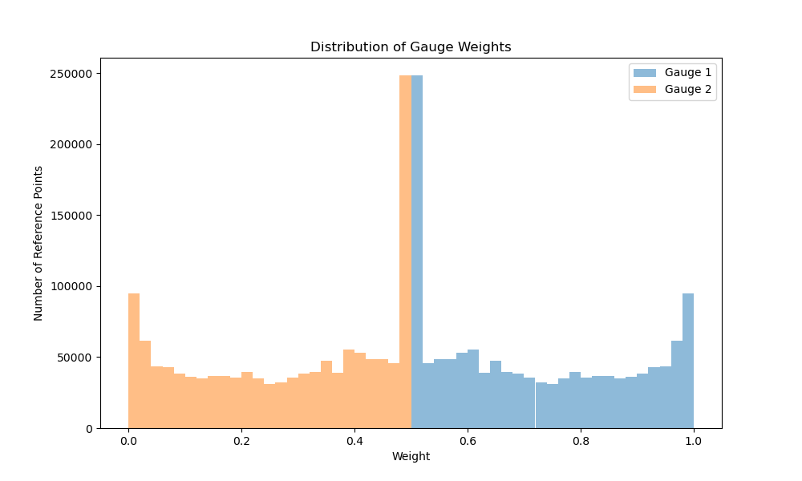

# Imputation Results Report
Generated on: 2025-01-23 09:15:41

## Summary Statistics

### Coverage
- Total reference points: 1298312

- Points with 1 gauge(s): 1098090 (84.6%)

- Points with 2 gauge(s): 783349 (60.3%)

- Points with 3 gauge(s): 508317 (39.2%)

### Distance Statistics (km)
| Gauge | Mean | Median | Min | Max |
|-------|------|--------|-----|-----|

| 1 | 26.8 | 20.7 | 0.0 | 200.0 |

| 2 | 34.8 | 33.6 | 0.8 | 200.0 |

| 3 | 38.1 | 38.1 | 3.5 | 158.8 |

## Visualizations

### Distance Distribution

### Weight Distribution

## Configuration
- Weight method: hybrid
- Maximum gauges per point: 3
- Close threshold: 1.0 km
- Maximum search distance: 200.0 km
- Minimum weight threshold: 0.01