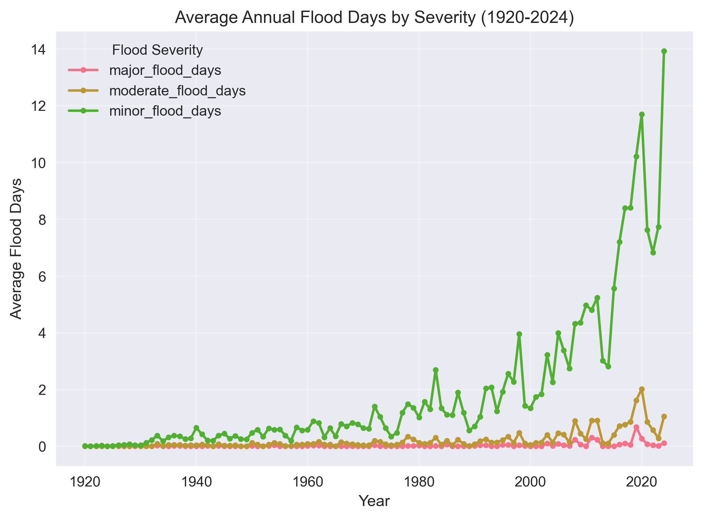
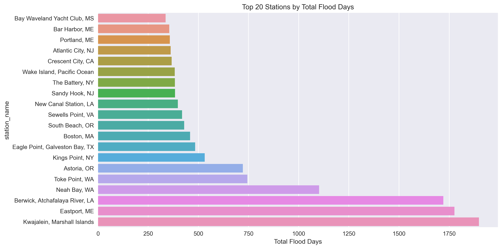
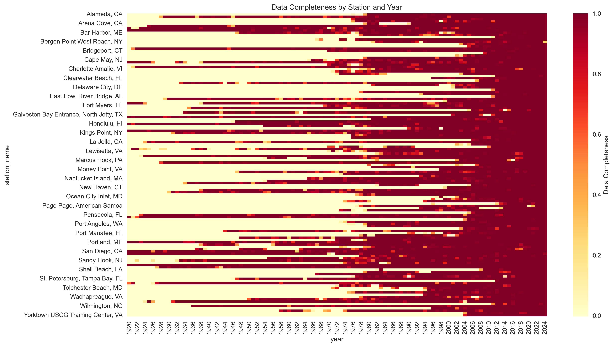
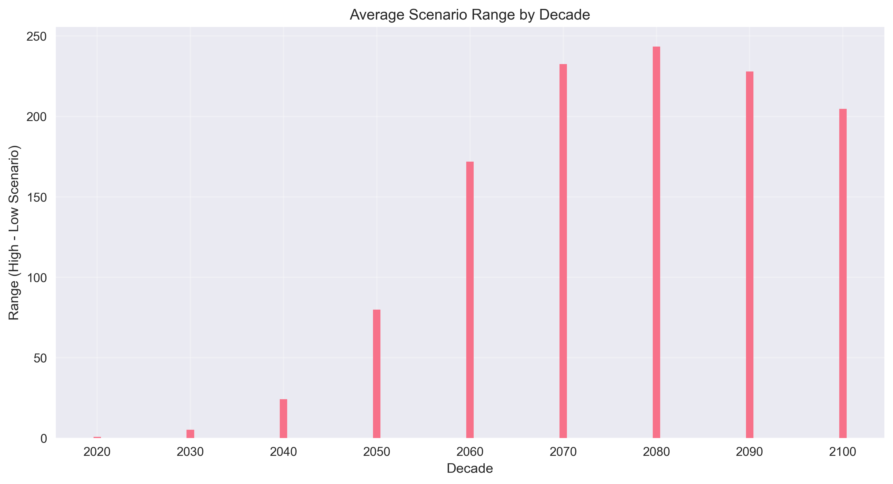
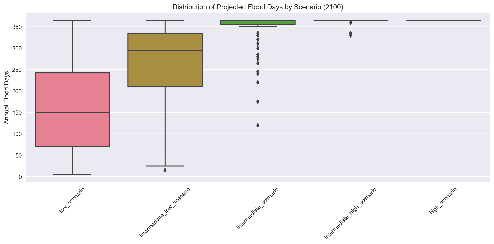

# High Tide Flooding (HTF) Analysis Report
Generated on 2025-01-19 07:32:56

## 1. Historical HTF Data Analysis

### Dataset Overview
- Total Records: 13,965
- Unique Stations: 133
- Year Range: 1920 to 2024
- Average Data Completeness: 51.1%

### Flooding Statistics
- Major Flood Days: 452
- Moderate Flood Days: 2,876
- Minor Flood Days: 26,323

### Top 5 Most Impacted Stations
- Kwajalein, Marshall Islands (1820000): 1,898 flood days
- Eastport, ME (8410140): 1,776 flood days
- Berwick, Atchafalaya River, LA (8764044): 1,721 flood days
- Neah Bay, WA (9443090): 1,102 flood days
- Toke Point, WA (9440910): 744 flood days

### Historical Trends Visualization

### Geographic Distribution

### Data Completeness

## 2. Projected HTF Data Analysis

### Dataset Overview
- Total Records: 855
- Unique Stations: 95
- Decade Range: 2020 to 2100

### Average Annual Flood Days by Scenario
- Low Scenario: 73.4 days/year
- Intermediate Low Scenario: 111.7 days/year
- Intermediate Scenario: 153.8 days/year
- Intermediate High Scenario: 188.1 days/year
- High Scenario: 205.7 days/year

### Uncertainty Analysis
- Average Range between High and Low Scenarios: 132.3 days/year

### Most Impacted Stations (2100)
- Nawiliwili, HI: 365.0 days/year
- Honolulu, HI: 365.0 days/year
- Mokuoloe, HI: 365.0 days/year
- Kahului, Kahului Harbor, HI: 365.0 days/year
- Kawaihae, HI: 365.0 days/year

### Projection Visualizations

### Uncertainty Analysis

### End-of-Century Distribution

## 3. Key Findings

1. Historical Data shows a clear trend of increasing flood frequency across all severity levels.
2. Data completeness varies significantly across stations and time periods.
3. Future projections indicate substantial increases in flooding frequency under all scenarios.
4. Hawaii stations are projected to be most severely impacted by the end of the century.
5. There is significant uncertainty in projections, with the range between scenarios increasing over time.
